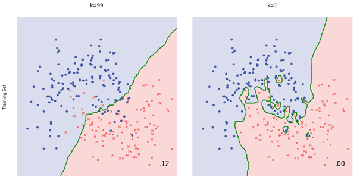
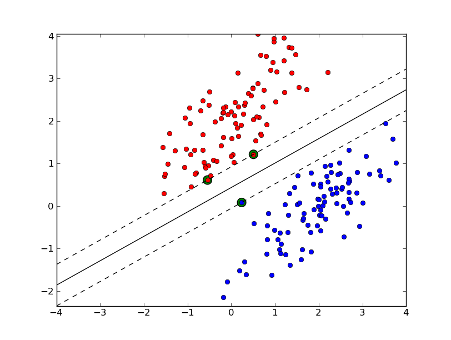

# Data Science Cheatsheets

The purpose of this README is two fold:
* To help you (data science practitioners) prepare for data science related interviews
* To introduce to people who don't know but want to learn some basic data science concepts

Here are the categories:

* [SQL](#sql)
* [Statistics](#statistics)
* [Supervised Learning](#supervised-learning)
* [Unsupervised Learning](#unsupervised-learning)
* [Stanford Materials](#stanford-materials)

## SQL

* [Finding Data Queries](#finding-data-queries)
* [Data Modification Queries](#data-modification-queries)
* [Reporting Queries](#reporting-queries)
* [Join Queries](#join-queries)
* [View Queries](#view-queries)
* [Altering Table Queries](#altering-table-queries)
* [Creating Table Query](#creating-table-query)

### Finding Data Queries

#### **SELECT**: used to select data from a database
* `SELECT` * `FROM` table_name;

#### **DISTINCT**: filters away duplicate values and returns rows of specified column
* `SELECT DISTINCT` column_name;

#### **WHERE**: used to filter records/rows
* `SELECT` column1, column2 `FROM` table_name `WHERE` condition;
* `SELECT` * `FROM` table_name `WHERE` condition1 `AND` condition2;
* `SELECT` * `FROM` table_name `WHERE` condition1 `OR` condition2;
* `SELECT` * `FROM` table_name `WHERE NOT` condition;
* `SELECT` * `FROM` table_name `WHERE` condition1 `AND` (condition2 `OR` condition3);
* `SELECT` * `FROM` table_name `WHERE EXISTS` (`SELECT` column_name `FROM` table_name `WHERE` condition);

#### **ORDER BY**: used to sort the result-set in ascending or descending order
* `SELECT` * `FROM` table_name `ORDER BY` column;
* `SELECT` * `FROM` table_name `ORDER BY` column `DESC`;
* `SELECT` * `FROM` table_name `ORDER BY` column1 `ASC`, column2 `DESC`;

#### **SELECT TOP**: used to specify the number of records to return from top of table
* `SELECT TOP` number columns_names `FROM` table_name `WHERE` condition;
* `SELECT TOP` percent columns_names `FROM` table_name `WHERE` condition;
* Not all database systems support `SELECT TOP`. The MySQL equivalent is the `LIMIT` clause
* `SELECT` column_names `FROM` table_name `LIMIT` offset, count;

#### **LIKE**: operator used in a WHERE clause to search for a specific pattern in a column
* % (percent sign) is a wildcard character that represents zero, one, or multiple characters
* _ (underscore) is a wildcard character that represents a single character
* `SELECT` column_names `FROM` table_name `WHERE` column_name `LIKE` pattern;
* `LIKE` ‘a%’ (find any values that start with “a”)
* `LIKE` ‘%a’ (find any values that end with “a”)
* `LIKE` ‘%or%’ (find any values that have “or” in any position)
* `LIKE` ‘[a-c]%’ (find any values starting with “a”, “b”, or “c”

#### **IN**: operator that allows you to specify multiple values in a WHERE clause
* essentially the IN operator is shorthand for multiple OR conditions
* `SELECT` column_names `FROM` table_name `WHERE` column_name `IN` (value1, value2, …);
* `SELECT` column_names `FROM` table_name `WHERE` column_name `IN` (`SELECT STATEMENT`);

#### **BETWEEN**: operator selects values within a given range inclusive
* `SELECT` column_names `FROM` table_name `WHERE` column_name `BETWEEN` value1 `AND` value2;
* `SELECT` * `FROM` Products `WHERE` (column_name `BETWEEN` value1 `AND` value2) `AND NOT` column_name2 `IN` (value3, value4);
* `SELECT` * `FROM` Products `WHERE` column_name `BETWEEN` #01/07/1999# AND #03/12/1999#;

#### **NULL**: values in a field with no value
* `SELECT` * `FROM` table_name `WHERE` column_name `IS NULL`;
* `SELECT` * `FROM` table_name `WHERE` column_name `IS NOT NULL`;

#### **AS**: aliases are used to assign a temporary name to a table or column
* `SELECT` column_name `AS` alias_name `FROM` table_name;
* `SELECT` column_name `FROM` table_name `AS` alias_name;
* `SELECT` column_name `AS` alias_name1, column_name2 `AS` alias_name2;
* `SELECT` column_name1, column_name2 + ‘, ‘ + column_name3 `AS` alias_name;

#### **UNION**: set operator used to combine the result-set of two or more SELECT statements
* Each SELECT statement within UNION must have the same number of columns
* The columns must have similar data types
* The columns in each SELECT statement must also be in the same order
* `SELECT` columns_names `FROM` table1 `UNION SELECT` column_name `FROM` table2;
* `UNION` operator only selects distinct values, `UNION ALL` will allow duplicates

#### **INTERSECT**: set operator which is used to return the records that two SELECT statements have in common
* Generally used the same way as **UNION** above
* `SELECT` columns_names `FROM` table1 `INTERSECT SELECT` column_name `FROM` table2;

#### **EXCEPT**: set operator used to return all the records in the first SELECT statement that are not found in the second SELECT statement
* Generally used the same way as **UNION** above
* `SELECT` columns_names `FROM` table1 `EXCEPT SELECT` column_name `FROM` table2;

#### **ANY|ALL**: operator used to check subquery conditions used within a WHERE or HAVING clauses
* The `ANY` operator returns true if any subquery values meet the condition
* The `ALL` operator returns true if all subquery values meet the condition
* `SELECT` columns_names `FROM` table1 `WHERE` column_name operator (`ANY`|`ALL`) (`SELECT` column_name `FROM` table_name `WHERE` condition);

#### **GROUP BY**: statement often used with aggregate functions (COUNT, MAX, MIN, SUM, AVG) to group the result-set by one or more columns
* `SELECT` column_name1, COUNT(column_name2) `FROM` table_name `WHERE` condition `GROUP BY` column_name1 `ORDER BY` COUNT(column_name2) DESC;

#### **HAVING**: this clause was added to SQL because the WHERE keyword could not be used with aggregate functions
* `SELECT` `COUNT`(column_name1), column_name2 `FROM` table `GROUP BY` column_name2 `HAVING` `COUNT(`column_name1`)` > 5;

[back to current section](#sql)

### Data Modification Queries

#### **INSERT INTO**: used to insert new records/rows in a table
* `INSERT INTO` table_name (column1, column2) `VALUES` (value1, value2);
* `INSERT INTO` table_name `VALUES` (value1, value2 …);

#### **UPDATE**: used to modify the existing records in a table
* `UPDATE` table_name `SET` column1 = value1, column2 = value2 `WHERE` condition;
* `UPDATE` table_name `SET` column_name = value;

#### **DELETE**: used to delete existing records/rows in a table
* `DELETE FROM` table_name `WHERE` condition;
* `DELETE` * `FROM` table_name;

[back to current section](#sql)

### Reporting Queries

#### **COUNT**: returns the # of occurrences
* `SELECT COUNT (DISTINCT` column_name`)`;

#### **MIN() and MAX()**: returns the smallest/largest value of the selected column
* `SELECT MIN (`column_names`) FROM` table_name `WHERE` condition;
* `SELECT MAX (`column_names`) FROM` table_name `WHERE` condition;

#### **AVG()**: returns the average value of a numeric column
* `SELECT AVG (`column_name`) FROM` table_name `WHERE` condition;

#### **SUM()**: returns the total sum of a numeric column
* `SELECT SUM (`column_name`) FROM` table_name `WHERE` condition;

[back to current section](#sql)

### Join Queries

####  **INNER JOIN**: returns records that have matching value in both tables
* `SELECT` column_names `FROM` table1 `INNER JOIN` table2 `ON` table1.column_name=table2.column_name;
* `SELECT` table1.column_name1, table2.column_name2, table3.column_name3 `FROM` ((table1 `INNER JOIN` table2 `ON` relationship) `INNER JOIN` table3 `ON` relationship);

#### **LEFT (OUTER) JOIN**: returns all records from the left table (table1), and the matched records from the right table (table2)
* `SELECT` column_names `FROM` table1 `LEFT JOIN` table2 `ON` table1.column_name=table2.column_name;

### **RIGHT (OUTER) JOIN**: returns all records from the right table (table2), and the matched records from the left table (table1)
* `SELECT` column_names `FROM` table1 `RIGHT JOIN` table2 `ON` table1.column_name=table2.column_name;

#### **FULL (OUTER) JOIN**: returns all records when there is a match in either left or right table
* `SELECT` column_names `FROM` table1 ``FULL OUTER JOIN`` table2 `ON` table1.column_name=table2.column_name;

#### **Self JOIN**: a regular join, but the table is joined with itself
* `SELECT` column_names `FROM` table1 T1, table1 T2 `WHERE` condition;

[back to current section](#sql)

### View Queries

#### **CREATE**: create a view
* `CREATE VIEW` view_name `AS SELECT` column1, column2 `FROM` table_name `WHERE` condition;

#### **SELECT**: retrieve a view
* `SELECT` * `FROM` view_name;

#### **DROP**: drop a view
* `DROP VIEW` view_name;

[back to current section](#sql)

### Altering Table Queries

#### **ADD**: add a column
* `ALTER TABLE` table_name `ADD` column_name column_definition;

#### **MODIFY**: change data type of column
* `ALTER TABLE` table_name `MODIFY` column_name column_type;

#### **DROP**: delete a column
* `ALTER TABLE` table_name `DROP COLUMN` column_name;

[back to current section](#sql)

### Creating Table Query

### **CREATE**: create a table
* `CREATE TABLE` table_name `(`  
   `column1` `datatype`,  
   `column2` `datatype`,  
   `column3` `datatype`,  
   `column4` `datatype`,  
   `);`

[back to current section](#sql)

[back to top](#data-science-cheatsheets)

## Statistics

## Supervised Learning

* [Linear regression](#linear-regression)
* [Logistic regression](#logistic-regression)
* [Naive Bayes](#naive-bayes)
* [KNN](#knn)
* [SVM](#svm)
* [Decision tree](#decision-tree)
* [Random forest](#random-forest)
* [Boosting Tree](#boosting-tree)
* [MLP](#mlp)
* [CNN](#cnn)
* [RNN and LSTM](#rnn-and-lstm)

### Linear regression

* How to learn the parameter: minimize the cost function
* How to minimize cost function: gradient descent
* Regularization:
    - L1 (Lasso): can shrink certain coef to zero, thus performing feature selection
    - L2 (Ridge): shrink all coef with the same proportion; almost always outperforms L1
    - Elastic Net: combined L1 and L2 priors as regularizer
* Assumes linear relationship between features and the label
* Can add polynomial and interaction features to add non-linearity

[back to current section](#supervised-learning)

### Logistic regression

* Generalized linear model (GLM) for binary classification problems
* Apply the sigmoid function to the output of linear models, squeezing the target to range [0, 1]
* Threshold to make prediction: usually if the output > .5, prediction 1; otherwise prediction 0
* A special case of softmax function, which deals with multi-class problems

[back to current section](#supervised-learning)

### Naive Bayes

* Naive Bayes (NB) is a supervised learning algorithm based on applying [Bayes' theorem](https://en.wikipedia.org/wiki/Bayes%27_theorem)
* It is called naive because it builds the naive assumption that each feature are independent of each other
* NB can make different assumptions (i.e., data distributions, such as Gaussian, Multinomial, Bernoulli)
* Despite the over-simplified assumptions, NB classifier works quite well in real-world applications, especially for text classification (e.g., spam filtering)
* NB can be extremely fast compared to more sophisticated methods

[back to current section](#supervised-learning)

### KNN

* Given a data point, we compute the K nearest data points (neighbors) using certain distance metric (e.g., Euclidean metric). For classification, we take the majority label of neighbors; for regression, we take the mean of the label values
* Note for KNN we don't train a model; we simply compute during inference time. This can be computationally expensive since each of the test example need to be compared with every training example to see how close they are
* There are approximation methods can have faster inference time by partitioning the training data into regions.
* When K equals 1 or other small number the model is prone to over-fitting (high variance), while when K equals number of data points or other large number the model is prone to under-fitting (high bias)

[back to current section](#supervised-learning)

### SVM

* Can perform linear, nonlinear, or outlier detection (unsupervised)
* Large margin classifier: using SVM we not only have a decision boundary, but want the boundary to be as far from the closest training point as possible
* The closest training examples are called support vectors, since they are the points based on which the decision boundary is drawn
* SVMs are sensitive to feature scaling

[back to current section](#supervised-learning)

### Decision tree

* Non-parametric, supervised learning algorithms
* Given the training data, a decision tree algorithm divides the feature space into regions. For inference, we first see which region does the test data point fall in, and take the mean label values (regression) or the majority label value (classification)
* **Construction**: top-down, chooses a variable to split the data such that the target variables within each region are as homogeneous as possible. Two common metrics: gini impurity or information gain, won't matter much in practice
* Advantage: simple to understand & interpret, mirrors human decision making
* Disadvantage:
    - can overfit easily (and generalize poorly) if we don't limit the depth of the tree
    - can be non-robust: A small change in the training data can lead to a totally different tree
    - instability: sensitive to training set rotation due to its orthogonal decision boundaries

[back to current section](#supervised-learning)

[back to top](#data-science-cheatsheets)

## Stanford Materials

The Stanford cheatsheets are collected from [Shervine Amidi's teaching materials](https://stanford.edu/~shervine/teaching/):

* [CS221 - Artificial Intelligence](https://github.com/khanhnamle1994/cracking-the-data-science-interview/tree/master/Cheatsheets/Stanford-CS221-Artificial-Intelligence)
* [CS229 - Machine Learning](https://github.com/khanhnamle1994/cracking-the-data-science-interview/tree/master/Cheatsheets/Stanford-CS229-Machine-Learning)
* [CS230 - Deep Learning](https://github.com/khanhnamle1994/cracking-the-data-science-interview/tree/master/Cheatsheets/Stanford-CS230-Deep-Learning)

[back to top](#data-science-cheatsheets)
